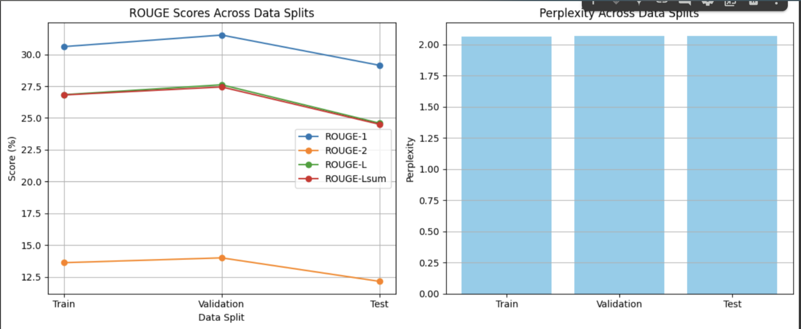
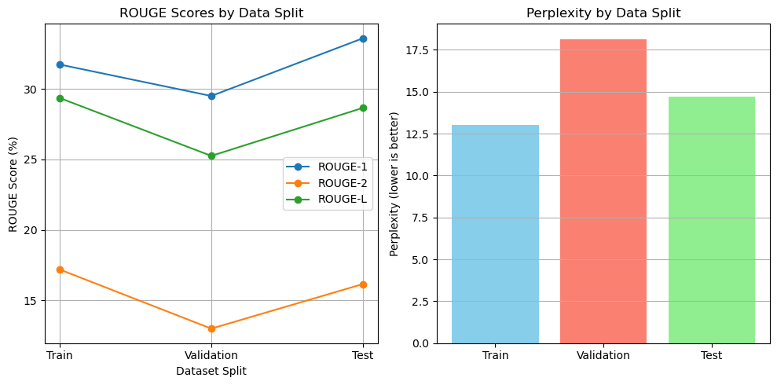

# Headline Generation using T5-base

## Objective
This project builds a text-to-text transformer model using **T5-base** to generate news headlines from article summaries. The goal is to support **fast news curation** and enable **high-level content understanding**.

---

## Dataset Description

**Source**: Babel Briefings (English portion)

### Motivation
This dataset contains news article summaries paired with their original headlines. It supports research in:
- Headline generation
- Automatic summarization
- Media synthesis

### Collection Context
- **Text Type**: Journalistic summaries
- **Target**: Headlines
- **Access**: Public dataset for research
- **Structure**: Input = summary, Output = headline

---

### Preprocessing

- Train/Validation/Test split from either ~2,000 or ~5,000 English samples
- Summary prefixed with `"headline:"` to guide T5
- Tokenization via `T5Tokenizer`
  - Max input length: 512 tokens
  - Max target length: 64 tokens (5k samples) or 32 tokens (2k samples)

---

## Project Goal

Predict concise, fluent headlines from short article summaries to support:
- Faster editing and publishing workflows
- Scalable news summarization
- Reader-friendly news browsing

---

## Workflow Overview

### Inputs & Outputs
- **Input**: Article summaries (text)
- **Output**: Predicted headlines (text)

### Pipeline
1. Clean and tokenize content
2. Add prefix for instruction tuning
3. Train T5 model using HuggingFace Trainer

---

## Modeling Details

| Feature | Value |
|--------|-------|
| **Model Type** | T5ForConditionalGeneration |
| **Architecture** | Text-to-Text Transformer |
| **Training Framework** | HuggingFace `Seq2SeqTrainer` |
| **Tokenizer** | T5Tokenizer |
| **Epochs** | 4 |
| **Batch Size** | 8 |
| **Learning Rate** | 5e-5 |
| **Device** | Apple M1 (MPS) |

---

## Evaluation Metrics

- **ROUGE-1**: Unigram overlap
- **ROUGE-2**: Bigram overlap
- **ROUGE-L**: Longest common subsequence
- **Perplexity**: Confidence of predictions

### Evaluation Method:
- Decode generated predictions
- Strip padding/special tokens
- Apply ROUGE via `evaluate` library
- Compute perplexity from model loss

---

## Training with 2000 Samples (Small-Scale Experiment)

In an initial experiment, we trained the model on **2,000 samples** for 4 epochs to evaluate the feasibility of headline generation on a lightweight dataset.

**Hyperparameters:**
- Epochs: 4
- Batch size: 8
- Learning rate: 2e-5
- Max input length: 512
- Max target length: 32
- Beam search: 5 beams
- Length penalty: 2.0

### Evaluation: ROUGE & Perplexity

| Split      | ROUGE-1 | ROUGE-2 | ROUGE-L | ROUGE-Lsum | Perplexity |
|------------|----------|----------|-----------|--------------|------------|
| Train      | 30.61    | 13.62    | 26.83     | 26.81        | 2.06       |
| Validation | 31.52    | 14.00    | 27.61     | 27.44        | 2.07       |
| Test       | 29.14    | 12.15    | 24.59     | 24.50        | 2.07       |

---

## Training with 5000 Samples (Full Run)

The primary training run used **5,000 samples** over 4 epochs with the same model architecture (`T5-base`). Results show higher overall ROUGE but increased perplexity.

| Split | ROUGE-1 | ROUGE-2 | ROUGE-L | Perplexity |
|-------|---------|---------|---------|------------|
| Train | 31.73%  | 17.18%  | 29.35%  | 12.99      |
| Val   | 29.50%  | 12.99%  | 25.25%  | 18.14      |
| Test  | 33.59%  | 16.15%  | 28.65%  | 14.70      |

---

## Trade-off Discussion: 2K vs 5K Samples

- The **2k-sample model** achieved **excellent perplexity (~2.07)** across all splits, suggesting very confident and stable predictions. However, it slightly underperformed in ROUGE scores compared to the 5k-sample model.
- The **5k-sample model** produced **stronger ROUGE metrics**, especially ROUGE-2 and ROUGE-L, indicating better linguistic overlap with actual headlines. However, its **perplexity was higher**, possibly due to overfitting or increased variability in the larger dataset.
- **Conclusion**: The 2k model is leaner and more controlled, while the 5k model generalizes better but at the cost of confidence. Use case determines which to prefer: speed/stability vs. headline fidelity.

---

## Highlights

- **Minimal hallucination** thanks to strong perplexity control (especially in 2k-sample run).
- **Bad word filtering** prevents irrelevant outputs like `"True"` and `"False"`.
- **Instruction-style prompting** via task-specific prefix: `"headline:"`.

---

## Sample Prediction

| Summary | Generated Headline | Actual Headline |
|--------|---------------------|-----------------|
| Dwayne ‘The Rock’ Johnson made an appearance on Impact Wrestling’s Bound For Glory PPV. He was there to induct former rival and real-life friend Ken Shamrock. ‘The World’s Most Dangerous Man’ faced T… [+2422 chars] ... | Dwayne The Rock Johnson inducts former rival Ken Shamrock - PPV | WWE Legend The Rock Makes a Special Appearance on Impact Wrestling - EssentiallySports |

---

## Model Limitations

- May generate vague or generic headlines
- Truncated outputs on very long inputs
- Limited to quality of summary input

---

## Deployment Notes

- Checkpoints saved via HuggingFace
- Model is ready for inference via pipeline
- Easily extendable using T5-large or BART

---

## Future Enhancements

- Train with more data (~10K+ samples)
- Switch to `T5-base` or `T5-large` for stronger performance
- Explore top-k and nucleus sampling
- Improve dataset with named entity normalization
